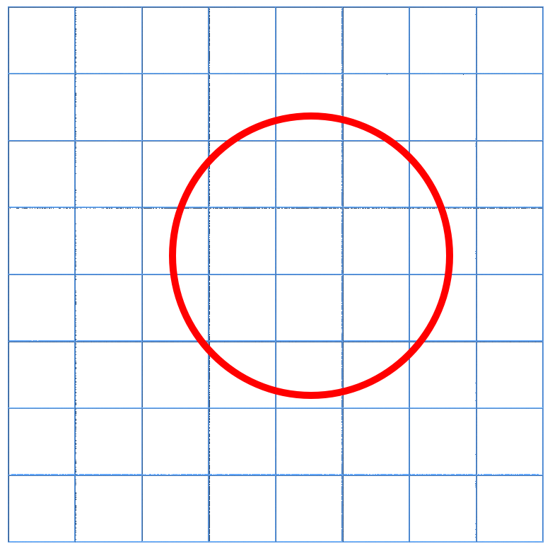
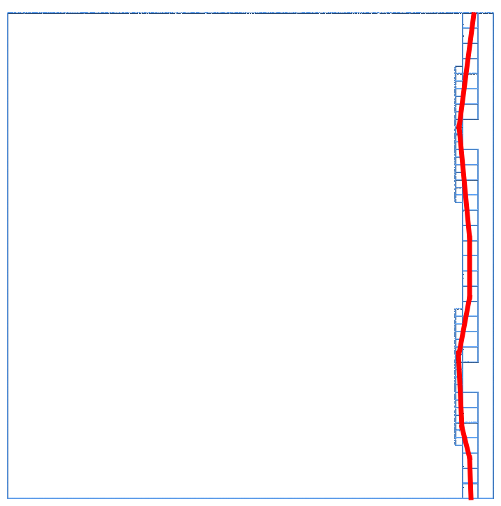
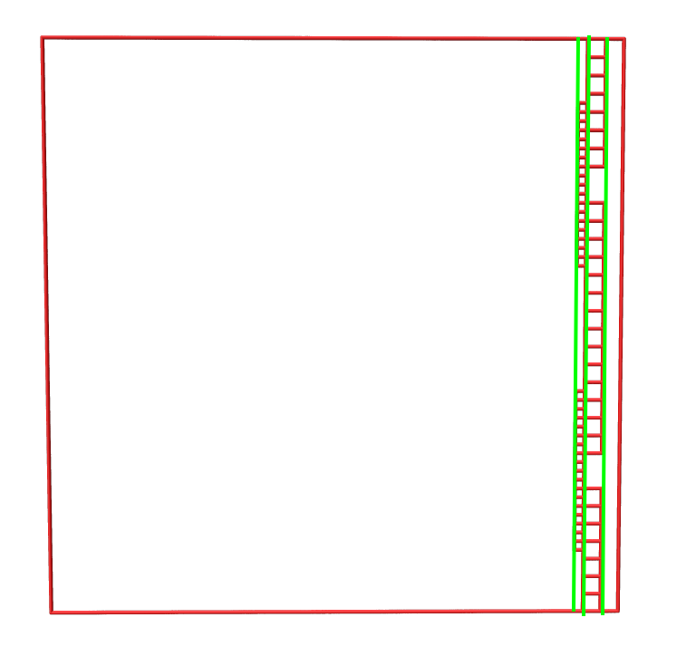

# 问题
相比之前的文章，本文将讨论带有精度控制的 NURBS 曲面求交问题。

# 步骤

Stage 1:

1. 输入两个曲面 $S_1, S_2$，以及精度 $tol$。

2. 计算 $S_1, S_2$ 的包围盒。

3. 判断两个包围盒是否相交，若不相交则结束。

4. 若相交，对 $S_1, S_2$ 四叉细分。

5. 对每个四叉树节点，计算每个节点包围盒。

循环 step3-5，直到相交的节点包围盒的对角线长度小于 $tol$。

*Stage1 得到可能相交的区域。这些区域的细分 level 不同。*

Stage 2:

6. 使用 C-S 方法计算边界交点。

7. 对于曲面法向近似同向，且没有边界交点的区域，使用 SIGGRAPH 的方法追踪交点。

8. 使用追踪法，或使用细分法的结果计算曲线拓扑结构。

# 技术点说明

## 精度控制

使用 lipschitz 方法控制精度。

对于一个区域 $[s,t]\times[u,v]$，使用区间计算方法带入到函数 $R_x, R_y, R_z$ 中，得到区间 $[R_xmin, R_xmax]\times[R_ymin, R_ymax]\times[R_zmin, R_zmax]$。根据区间的对角线长度，可以得到一个从参数域到物理空间的映射程度数值。利用这个数值，可以知道要达到目标精度，需要设定多大的参数。如四叉树的深度，数值方法的精度等。

## C-S 方法加速

stage1 后得到的区域不是均匀统一的，对于相交的叶子节点，树的深度不同。如何加速 C-S 计算？
**TO BE CONTINUED...**

## 四叉树与交点数据结构

对于非均匀的四叉树细分与边缘交点，四叉树的节点数据结构如何设计？交点数据结构如何设计？
**TO BE CONTINUED...**

# 方法区别

## 之前:

1. 输入曲面 $S_1, S_2$, BVH 深度 $d$.

2. 对 $S_1, S_2$ 进行 $2^d$ 次四叉细分.

3. 构建 BVH, 对每个节点计算 OBB.

4. 进行 BVH 相交判断, 标记可能相交的子面片对 $(S_{i}, S_{j})$. 其中 $S_{i}$ 为 $S_1$ 的子面片，$S_{j}$ 为 $S_2$ 的子面片。

5. 精确计算交点:

    - 对每对子面片 $(S_{i}, S_{j})$ 进行 C-S 方法计算边界交点。

    - 对可能相切的子面片对 $(S_{i}, S_{j})$ 使用 SIGGRAPH 方法计算边界交点。

6. 使用 BVH 的四叉树信息,连接边界交点, 得到曲线拓扑结构。

7. B 样条交线拟合.

缺点:在参数域上使用均匀的四叉树细分，只能控制参数域上精度，不能控制物理空间上的精度。因此，可能会出现物理空间上的交点距离大于 $tol$ 的情况。

优点:能够大量复用基函数计算,更快构建 BVH.

## 新方法1:

1. 输入曲面 $S_1, S_2$, 精度 $tol$.

2. 迭代循环下面步骤:

    - 计算 $S_1, S_2$ 的包围盒.

    - 判断两个包围盒是否相交，若不相交则结束。

    - 若两个包围盒相交，判断包围盒对角线长度是否小于 $tol$，若是则满足精度要求,结束。

    - 若两个包围盒相交且不满足精度要求, 对 $S_1, S_2$ 四叉细分, 进行 4x4 次的迭代递归计算.

此时确保了每对相交的节点内交点的三维空间距离小于 $tol$。

3. 精确计算交点:

    - 对每个叶子节点, 使用 C-S 方法计算边界交点.

    - 对于曲面法向近似同向，且没有边界交点的区域，使用 SIGGRAPH 的方法追踪交点。

4. 使用 BVH 的四叉树信息,连接边界交点, 得到曲线拓扑结构。

优点:能够使用 lipschitz 方法控制物理空间上的精度，保证交点距离小于 $tol$。

缺点:节点插入可能无法复用基函数计算，时间复杂度增加,算法实现难度增加。

## CS 计算加速

若对每个小区域四条边界线都进行 C-S 方法计算，时间复杂度过高,且出现重复计算。

如图所示，先记录所有需要进行计算的等参线,然后对等参线与另一曲面进行 C-S 方法计算。图中仅画出 u 等参线，v 等参线同理。

具体方法:

1. 遍历所有可能相交的叶子节点，记录边界参数。

2. 对于每个边界参数，计算等参线。

3. 对于等参线，计算交点。

