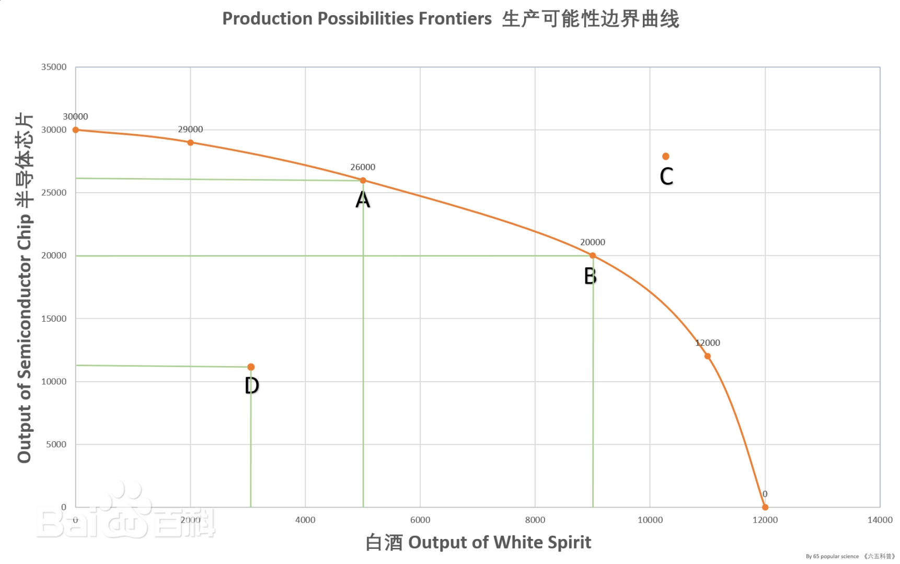
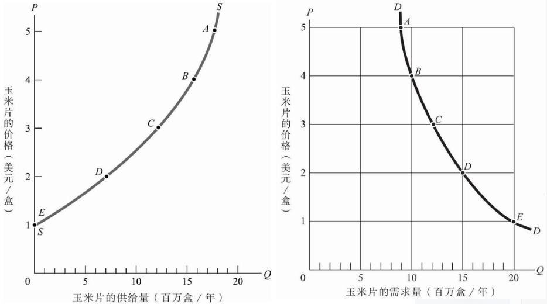
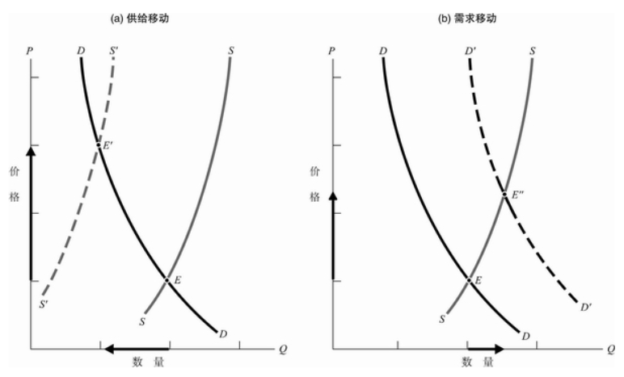

# PPF

书中PPF指**生产可能性边界**，描述了给定数量资源下，生产最大数量产品的边界。它说明更多生产一种商品时，另一种商品的生产数量会下降。不同产品之间会有资源竞争关系，这些竞争不仅指需要同样的原料，也包括工时、资本、生产材料等。

本书中类似的二维曲线有很多种，其都是仅考虑两个变量间的关系。实际情况可能复杂，即为n维空间上的一个曲面。如考虑黄油-炮弹-科技随时间发展，则PPF应该时3维空间上的一个曲面；考虑黄油-炮弹-科技随时间发展-教育投资，则为3维空间上的一个曲面。

相似的，后文需求-价格表等，都可以高维空间在低维空间的一个等参面。

# 第三章 供给与需求的基本原理

本章静态地分析了供给/需求与价格的变化：当价格上升，供给会增多（工厂逐利），需求会下降（消费者寻求替代品）；当价格下降，供给减少（工厂无利可图），需求上升（消费者用货币选票投票）。两条曲线的交点是均衡状态。

单单看供给/需求图时，注意此表说明是价格影响其他供给/需求，而非相反。

而当关注供给-需求，需求上升，需求曲线整体向右移动，导致均衡点上升；当供给下降，供给曲线整体向左移动。
