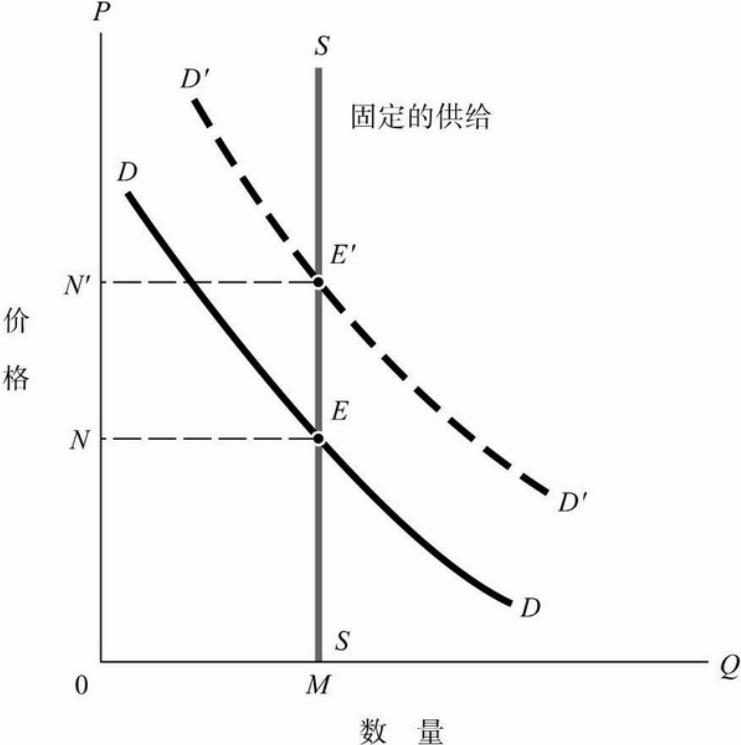
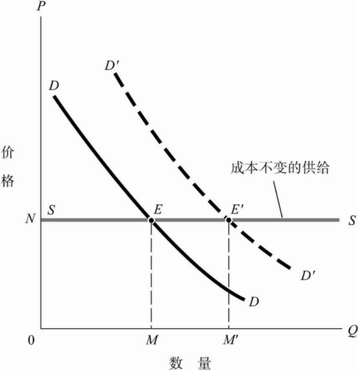
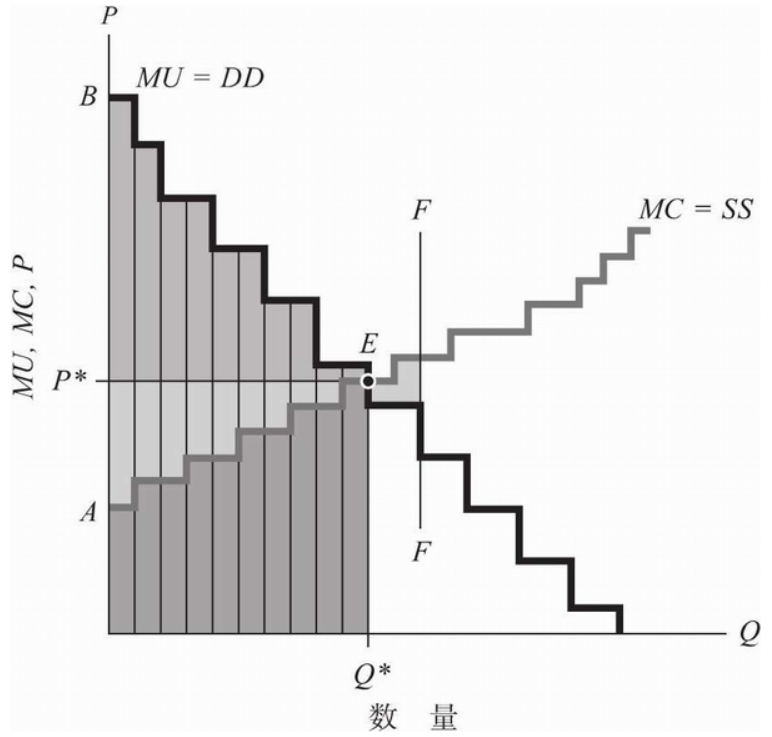

# 不止经济学


*恐怕事情就是这样的。假如有20种相互影响的因素，那么你必须学会处理这种错综复杂的关系——因为世界就是这样的。但如果你能像达尔文那样，带着好奇的毅力，循序渐进地去做，那么你就不会觉得这是艰巨的任务。你将会惊讶地发现自己完全能够胜任。 --查理 芒格*


从小对资本主义的印象便是“牛奶倒入河里”的浪费，“资本家与工人”的对立，以及“资本来到世间，从头到脚，每个毛孔都滴着血和肮脏的东西。”的批判。然而，现实社会又无处不涉及着市场、经济与资本。社会是如何运行的？为什么有些人富有，有些人贫穷？我想，从社会的基础运行机制开始，是理解这个问题的第一步。经济学是一个很好的入口。从生产可能性边界到供需关系，从竞争到稀缺，从社会效率到社会公平，经济学所讲远非单纯“经济”。

# 效率与公平

市场经济追求的是劳动剩余的最大值，即消费者剩余与生产剩余的总和。举例来说，对于一件衣服，消费者愿意支付100元，实际市场定价是80元，那么消费者剩余是20元；而生产者愿意以50元卖出一件衣服，实际市场定价是80元，那么生产者剩余是30元。市场奖励了那些更有效率的生产者，也奖励了那些能从相同商品中获得更多价值的消费者。相对应的，市场惩罚了那些效率低下的生产者，也惩罚了那些从商品中获得价值少于市场价格的消费者。在完全竞争的市场中，通过供需关系，市场价格会自动调整，以保证社会效率的最大化。

然而，效率便是我们想要的全部吗？答案当然是否定的。从社会来讲，公平是另一大追求。实际上，市场经济与资本主义往往导致贫富差距的扩大，导致社会不公平。在商品生产中，生产要素包括资本、劳动力、土地等。少部分人掌握着大量的资本，这些资本家依靠资本的增值来获取利润，由于复利效应其身家会指数上涨。而大部分人只能靠出卖劳动力来维持生计，无法享受复利效应。长此以往，富者愈富，贫者愈贫。

为什么公平是重要的？这可能要从社会、国家的创建目的来说。当今世界，国家往往是人民的代表，是人民的利益的代表。从初心上来说，国家意志是大多数人民的意志（以人数投票），而非少部分人的利益的代表。虽然现实中，国家往往受到资本家/政客/利益集团的影响，但众所周知，若舍弃了大多数人民的利益，国家的合法性便会受到质疑，起义便会随之而来。因此，保障大部分群体的利益，弱化社会矛盾，降低贫富差距，对维护国家稳定是至关重要的。

公平是一个主观概念。富者认为公平是“创造多少价值，就能获得多少价值”，而穷者认为公平是“付出多少劳动，就能获得多少价值”。孰是孰非？这恐怕既是一个政治问题，也是一个现实问题。

然而，效率与公平往往是矛盾的。为了追求效率，市场经济往往会导致贫富差距的扩大。为了追求公平，往往会牺牲效率。两者正如跷跷板一般，按下一头的问题，另一头的问题便会出现。

# 科学与人文

科学的追求是真理，是客观的。数学与物理是最典型的科学，正确的便是正确的，不存在模棱两可的结果。而人文则是主观的。哲学、文学、历史等人文学科，往往没有正确答案，只有考虑更全面的答案，或是出发角度不一样的答案。人文科学的进步往往通过讨论、辩论来实现，且一个结果往往与当时社会息息相关。历史虚无主义便是一个典型的反面例子。

人文这种主观性，往往会导致人们对其的轻视。而工科往往更被看重。诚然，工科的效益更为直接。哲学家的贡献往往是在几百年后才被人们运用，渗透到社会中。然而，人文科学的重要性不容忽视。人生的意义、社会的意义，这些问题往往是人文科学所关注的。通过对这些问题的思考与提炼，再用来指导法律、政策等，是人文科学的价值所在。

人文学科往往交错在一起。你想研究经济学？那你首先要懂得些数学与博弈论，还需要对政治和社会学有一些了解，若要进一步深入，还需要了解哲学与历史...经济学是社会运转中的一个环节。只学习经济学，是无法真正理解，且容易走火入魔的。正如查理芒格推崇那样，要有多元的知识，才能更好地理解这个世界。

# 一切都选择

无论对错，一切皆是选择。在一定尺度内，不存在这么一个标准的“正确选项”。传统价值观或家庭价值观中，往往会设定一个标准答案。成人之后，见过更多的人生，见过更多的选择，便会发现，这个世界上没有绝对的对错。每个人都会设定一个属于自己的“能量损失函数”。它既可能包括金钱、时间、精力，也可能包括道德、信仰、家庭等。每个人的选择，都是“试图”在这个“能量损失函数”下的最优解。尚且不谈是否真能找到这个最优解，但这个过程，便是人生的意义。

# 简写

书中简写：

- m-: marginal 边际
- a-: average 平均
- t-: total 总
- f-: fixed 固定
- v-: variable 可变
- -c: cost 成本
- -p: price 价格
- -r: revenue 收入
- -s: surplus 剩余
- -d: demand 需求
- -s: supply 供给
- q: quantity 数量

# PPF

书中PPF指**生产可能性边界**，描述了给定数量资源下，生产最大数量产品的边界。它说明更多生产一种商品时，另一种商品的生产数量会下降。不同产品之间会有资源竞争关系，这些竞争不仅指需要同样的原料，也包括工时、资本、生产材料等。

本书中类似的二维曲线有很多种，其都是仅考虑两个变量间的关系。实际情况可能复杂，即为n维空间上的一个曲面。如考虑黄油-炮弹-科技随时间发展，则PPF应该时3维空间上的一个曲面；考虑黄油-炮弹-科技随时间发展-教育投资，则为3维空间上的一个曲面。

相似的，后文需求-价格表等，都可以高维空间在低维空间的一个等参面。

# 第三章 供给与需求的基本原理

本章静态地分析了供给/需求与价格的变化：当价格上升，供给会增多（工厂逐利），需求会下降（消费者寻求替代品）；当价格下降，供给减少（工厂无利可图），需求上升（消费者用货币选票投票）。两条曲线的交点是均衡状态。

单单看供给/需求图时，注意此表说明是价格影响其他供给/需求，而非相反。

而当关注供给-需求，需求上升，需求曲线整体向右移动，导致均衡点上升；当供给下降，供给曲线整体向左移动。

# 第七章 成本分析

## 经济成本与企业会计

***收益表(income statement)/损益表(statement of profit and loss)***  关注的是***流量（flow）***，即在某一时间段内的收入和支出。收益表的基本原则是 **收入=支出+利润**。

***资产负债表(balance sheet)*** 是企业会计的另一个重要组成部分，它关注的是***存量（stock）***，记录了企业在某一时间点的资产和负债。资产负债表的一方是资产，另一方是负债和所有者权益（或净值，概念等价）。资产负债表的基本原则是 **资产=负债+所有者权益**。

### 折旧

折旧（depreciation）在损益表中，是指资产在使用过程中由于磨损、老化、过时等原因而减少其价值的过程。

例如购买一台价值1万元的机器，预期使用寿命10年。其在损益表中总流程什么样？

- 购买时，损益表中增加1万元的资产，同时减少1万元的现金。

- 之后每一年，机器价值减少1万元/10年=1000元，损益表中折旧费为1000元。

# 第八章 完全竞争市场分析

## 竞争行业的长期供给行为

区别于前几章讲的静态（短期）供给/需求，本章讲的是长期供给行为。

### 长期

在长期，企业可以自由进入或退出市场，且企业受到利润的驱动。

情况1： 如果任何数量的企业都可以按照同样的、不变的成本曲线进行生产的情况下，长期的供给曲线是水平的，接近与每个企业的最低平均成本。

情况2： 如果行业使用某种特殊资源，而这种资源的供给是有限的，那么长期供给曲线将是向上倾斜的。因为当市场需求增加时，企业会竞争这种资源，导致资源价格上升，从而提高了企业的平均成本；且企业为了获得更多产出，增加其他要素（如劳动力可变，但土地不可变），此时劳动力的边际产量会下降，但工资不变，导致平均成本上升。

### 短期

在短期，行业内生产资料往往具有稀缺性，遵循价格上升供给增加，价格下降供给减少的规律。

### 思考

首先，这部分考虑的是理想有效竞争市场，没有垄断等，也不存在认知偏差等诸多因素。

其次，本书前几章看图的思路是“价格影响供给/需求”，即 $供给=f(价格)$。而现实会更复杂，他们不仅相互影响，还会受到其他因素影响，如长期短期、是否完全竞争、政策等。更像是一个隐式的方程 $f(供给,价格)=0$, 这章的图表不能简单沿袭前几章的看图思路。

## 稀缺性影响的供给与需求

对比两个例子：

1. 大城市的租房市场，土地有限，即使租金提高，供给也不会增加。因此供给曲线是垂直的，价格上升，供给不变。当需求曲线右移，只会导致价格上升，而不会增加土地。

2. 水资源市场，水资源可以看做无限的，增加产量的成本是固定的。因此供给曲线是水平的。当需求曲线右移，价格不变，产量增加。

## 经济剩余

之前对`经济剩余`有误解，认为是追求生产能力的最大化，而会导致各种浪费。实际上，***经济剩余(economic surplus)*** 是指从生产和消费某一种物品中获得的福利或净效益。它是消费者剩余和生产者剩余的总和。

如图所示，消费者剩余是需求曲线与价格曲线之间的面积，生产者剩余是价格曲线与供给曲线之间的面积。经济剩余是两者之和。

对此理解：例如，某些消费者愿意支付100元买一件衣服，但实际价格是80元，那么消费者剩余是20元；而某些生产者愿意以50元卖出一件衣服，但实际价格是80元，那么生产者剩余是30元。经济剩余是20+30=50元。

**竞争性市场中，需求曲线和供给曲线的交点是经济剩余最大的点。** 即追求社会福利最大化，而非追求生产能力的最大化。

# 第九章 不完全竞争及其极端形式-垄断

完全竞争市场情况下，对每个企业来说，市场价格是给定的，企业生产多少产品，价格都是一样的。而在垄断市场中，企业生产的产品数量会影响市场价格。

导致竞争不完全性的因素有：规模经济（主要根源）；以法律限制形式出现的进入壁垒（如专利或政府管制）；高的进入成本；广告以及产品差异化。

最高利润情况下，企业的边际收入等于边际成本，即 $MR=MC$。

而在完全竞争市场中，企业的边际收入等于边际成本等于价格，即 $MR=MC=P$。

***边际原则***：在进行决策时，应当注意计算边际的或未来的收益与损失，而不应该考虑先前已经支付的沉没成本。

# 第十章 寡头和垄断竞争

四种主要的市场结构：

- 没有一个企业可以大到足以影响市场价格的完全竞争市场。

- 许多企业生产略有差别产品的垄断竞争市场。

- 行业为少数几家企业所主宰的，作为不完全竞争中间形式的寡头市场。

- 只有一家企业生产整个产业所有产品的垄断市场。

## 有限理性

对于利润最大化的一种限制是“有限理性”。这条原则认识到，做出决策是要花费代价的。因此，经理们往往会做出并非十全十美的决策，他们经常要使用“拍脑袋”的方法，以节省研究和决策的时间。“拍脑袋”是一种经验性的决策方法，但往往很有用。

## 信息经济

今天，信息的生产成本很大，而再生产成本非常小，因此它与一般的商品有本质的差别。书中写，信息经济的分析较为特殊，其再生产成本很小，但生产成本很大。政府设立了知识产权来保护专利、版权、商业机密及电子传媒。

增加信息经济的产量，对其总成本的影响很小。在这种情况下，边际成本约等于零，不能使用传统的边际成本等于边际收入的原则来确定最高收益。其收益还受到市场需求等诸多因素的影响。

# 第十一章 不确定性和博弈论

## 保险市场

有效的保险市场经营条件：

1. 必须存在大量的独立事件

2. 没有道德风险

3. 没有逆向选择

否则，政府可以介入提供社会保险。通过强制性的社会保险，政府可以消除逆向选择。

## 博弈论

博弈论研究的是两个或多个决策者之间的相互作用。选择对每一方都产生共同影响的行动或策略。博弈论的基本概念是策略和收益矩阵。

有时候，可能存在一种“占优策略”，即一种策略，无论对方选择什么策略，都是最好的策略。这种策略称为“纳什均衡”。

在“看不见的手”博弈中，亚当·斯密认为，每个人都追求自己的利益，最终会导致整个社会的利益。

在赢者通吃（winner-take-all）博弈中，可能引致过多的参与者，导致社会资源的浪费，且加剧名誉和收入分配的不平等。

# 第十四章 市场和经济效率

亚当斯密宣称，凭借“看不见的手”，那些在完全竞争市场中追求自己利益的人，能最有效地促进公共利益。

两种商品的边界效用比率等于两种商品的价格比率。这是消费者的效用最大化条件。

两种产品的边际成本比率等于两种产品的价格比率。这是生产者的效益最大化条件。

边际成本比率反应了社会将一种产品转换为另一种产品的比率。且由于边际成本等于价格，因此价格比率反应了这种转换比率。

竞争价格提供了各种商品相对稀缺性的信号。